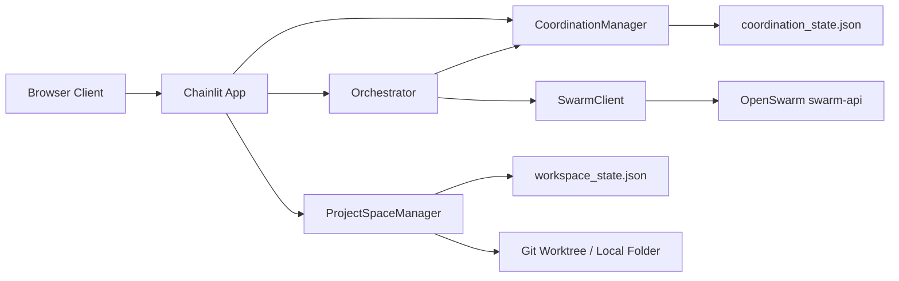

# Architecture

Chat Orchestrate has three layers:

1. **Chainlit UI**
   - Maintains each browser client's active project space in `cl.user_session`.
   - Streams agent turns as separate chat messages.
   - Provides slash commands for project-space operations.

2. **Orchestrator**
   - Loads a role list from `DEFAULT_AGENT_SET`.
   - Elects or reads the current orchestrator machine.
   - Creates a delegated task plan for online machines.
   - Calls agents in order and passes prior outputs as context.
   - Emits every agent handoff plus a final run summary.

3. **Coordination Manager**
   - Stores machine heartbeats in `COORDINATION_STATE_PATH`.
   - Tracks which machine has `orchestrator` status.
   - Records role-specific delegated tasks for each run.

4. **Swarm Client**
   - `OpenSwarmClient` calls `POST /v1/chat/completions` on `swarm-api`.
   - `LocalPreviewSwarmClient` gives deterministic responses for local UI testing.

## Why the Adapter Is Narrow

OpenSwarm is evolving quickly. Keeping the UI behind a small REST client means this app can deploy independently while OpenSwarm owns blueprints, model routing, MCP tools, and its own database/configuration.

## Data Flow

## Extension Points

- Add agents in `src/chat_orchestrate/orchestrator.py`.
- Replace the sequential loop with parallel stages when agents can work independently.
- Add persistence for run logs once multi-user audit history matters.
- Replace file-backed coordination with Redis/Postgres when workers span unreliable network storage.
- Add GitHub App or OAuth support before allowing remote repository mutation from chat.
